.. _k3z-figure-appendix:

Figure Appendix
===============

This appendix renders the current K3Z figure set inline for direct review in the
student docs. Filenames are retained in captions for traceability and QA.

Analysis Area Map
-----------------

.. figure:: _static/k3z_analysis_area_map.png
   :alt: K3Z analysis area map by AU
   :width: 95%

   K3Z analysis-area fragments map colored by AU (source: ``docs/_static/k3z_analysis_area_map.png``).

Strata Distribution Figure
--------------------------

.. figure:: ../plots/strata-tsak3z.png
   :alt: strata-tsak3z.png
   :width: 95%

   Strata composition and area distribution (source: ``plots/strata-tsak3z.png``).

VDYP Low/Medium/High Envelopes
------------------------------

.. figure:: ../plots/vdyp_lmh_tsak3z-00-CWHvm_HW+FDC.png
   :alt: vdyp_lmh_tsak3z-00-CWHvm_HW+FDC.png
   :width: 90%

   VDYP low/medium/high envelope for stratum ``00-CWHvm_HW+FDC`` (source: ``plots/vdyp_lmh_tsak3z-00-CWHvm_HW+FDC.png``).

.. figure:: ../plots/vdyp_lmh_tsak3z-01-CWHvm_FDC+HW.png
   :alt: vdyp_lmh_tsak3z-01-CWHvm_FDC+HW.png
   :width: 90%

   VDYP low/medium/high envelope for stratum ``01-CWHvm_FDC+HW`` (source: ``plots/vdyp_lmh_tsak3z-01-CWHvm_FDC+HW.png``).

.. figure:: ../plots/vdyp_lmh_tsak3z-02-CWHvm_CW+HW.png
   :alt: vdyp_lmh_tsak3z-02-CWHvm_CW+HW.png
   :width: 90%

   VDYP low/medium/high envelope for stratum ``02-CWHvm_CW+HW`` (source: ``plots/vdyp_lmh_tsak3z-02-CWHvm_CW+HW.png``).

.. figure:: ../plots/vdyp_lmh_tsak3z-03-CWHvm_HW+CW.png
   :alt: vdyp_lmh_tsak3z-03-CWHvm_HW+CW.png
   :width: 90%

   VDYP low/medium/high envelope for stratum ``03-CWHvm_HW+CW`` (source: ``plots/vdyp_lmh_tsak3z-03-CWHvm_HW+CW.png``).

.. figure:: ../plots/vdyp_lmh_tsak3z-04-CWHvm_DR+HW.png
   :alt: vdyp_lmh_tsak3z-04-CWHvm_DR+HW.png
   :width: 90%

   VDYP low/medium/high envelope for stratum ``04-CWHvm_DR+HW`` (source: ``plots/vdyp_lmh_tsak3z-04-CWHvm_DR+HW.png``).

.. figure:: ../plots/vdyp_lmh_tsak3z-05-CWHvm_HW+SS.png
   :alt: vdyp_lmh_tsak3z-05-CWHvm_HW+SS.png
   :width: 90%

   VDYP low/medium/high envelope for stratum ``05-CWHvm_HW+SS`` (source: ``plots/vdyp_lmh_tsak3z-05-CWHvm_HW+SS.png``).

.. figure:: ../plots/vdyp_lmh_tsak3z-06-CWHvm_CW+YC.png
   :alt: vdyp_lmh_tsak3z-06-CWHvm_CW+YC.png
   :width: 90%

   VDYP low/medium/high envelope for stratum ``06-CWHvm_CW+YC`` (source: ``plots/vdyp_lmh_tsak3z-06-CWHvm_CW+YC.png``).

.. figure:: ../plots/vdyp_lmh_tsak3z-07-CWHvm_HW+BA.png
   :alt: vdyp_lmh_tsak3z-07-CWHvm_HW+BA.png
   :width: 90%

   VDYP low/medium/high envelope for stratum ``07-CWHvm_HW+BA`` (source: ``plots/vdyp_lmh_tsak3z-07-CWHvm_HW+BA.png``).

.. figure:: ../plots/vdyp_lmh_tsak3z-08-CWHvm_CW+PLC.png
   :alt: vdyp_lmh_tsak3z-08-CWHvm_CW+PLC.png
   :width: 90%

   VDYP low/medium/high envelope for stratum ``08-CWHvm_CW+PLC`` (source: ``plots/vdyp_lmh_tsak3z-08-CWHvm_CW+PLC.png``).

VDYP Fit Diagnostics
--------------------

.. figure:: ../plots/vdyp_fitdiag_tsak3z-00-CWHvm_HW+FDC-H.png
   :alt: vdyp_fitdiag_tsak3z-00-CWHvm_HW+FDC-H.png
   :width: 90%

   VDYP fit diagnostic for stratum/SI bin ``00-CWHvm_HW+FDC-H`` (source: ``plots/vdyp_fitdiag_tsak3z-00-CWHvm_HW+FDC-H.png``).

.. figure:: ../plots/vdyp_fitdiag_tsak3z-00-CWHvm_HW+FDC-L.png
   :alt: vdyp_fitdiag_tsak3z-00-CWHvm_HW+FDC-L.png
   :width: 90%

   VDYP fit diagnostic for stratum/SI bin ``00-CWHvm_HW+FDC-L`` (source: ``plots/vdyp_fitdiag_tsak3z-00-CWHvm_HW+FDC-L.png``).

.. figure:: ../plots/vdyp_fitdiag_tsak3z-00-CWHvm_HW+FDC-M.png
   :alt: vdyp_fitdiag_tsak3z-00-CWHvm_HW+FDC-M.png
   :width: 90%

   VDYP fit diagnostic for stratum/SI bin ``00-CWHvm_HW+FDC-M`` (source: ``plots/vdyp_fitdiag_tsak3z-00-CWHvm_HW+FDC-M.png``).

.. figure:: ../plots/vdyp_fitdiag_tsak3z-01-CWHvm_FDC+HW-H.png
   :alt: vdyp_fitdiag_tsak3z-01-CWHvm_FDC+HW-H.png
   :width: 90%

   VDYP fit diagnostic for stratum/SI bin ``01-CWHvm_FDC+HW-H`` (source: ``plots/vdyp_fitdiag_tsak3z-01-CWHvm_FDC+HW-H.png``).

.. figure:: ../plots/vdyp_fitdiag_tsak3z-01-CWHvm_FDC+HW-L.png
   :alt: vdyp_fitdiag_tsak3z-01-CWHvm_FDC+HW-L.png
   :width: 90%

   VDYP fit diagnostic for stratum/SI bin ``01-CWHvm_FDC+HW-L`` (source: ``plots/vdyp_fitdiag_tsak3z-01-CWHvm_FDC+HW-L.png``).

.. figure:: ../plots/vdyp_fitdiag_tsak3z-01-CWHvm_FDC+HW-M.png
   :alt: vdyp_fitdiag_tsak3z-01-CWHvm_FDC+HW-M.png
   :width: 90%

   VDYP fit diagnostic for stratum/SI bin ``01-CWHvm_FDC+HW-M`` (source: ``plots/vdyp_fitdiag_tsak3z-01-CWHvm_FDC+HW-M.png``).

.. figure:: ../plots/vdyp_fitdiag_tsak3z-02-CWHvm_CW+HW-H.png
   :alt: vdyp_fitdiag_tsak3z-02-CWHvm_CW+HW-H.png
   :width: 90%

   VDYP fit diagnostic for stratum/SI bin ``02-CWHvm_CW+HW-H`` (source: ``plots/vdyp_fitdiag_tsak3z-02-CWHvm_CW+HW-H.png``).

.. figure:: ../plots/vdyp_fitdiag_tsak3z-02-CWHvm_CW+HW-L.png
   :alt: vdyp_fitdiag_tsak3z-02-CWHvm_CW+HW-L.png
   :width: 90%

   VDYP fit diagnostic for stratum/SI bin ``02-CWHvm_CW+HW-L`` (source: ``plots/vdyp_fitdiag_tsak3z-02-CWHvm_CW+HW-L.png``).

.. figure:: ../plots/vdyp_fitdiag_tsak3z-02-CWHvm_CW+HW-M.png
   :alt: vdyp_fitdiag_tsak3z-02-CWHvm_CW+HW-M.png
   :width: 90%

   VDYP fit diagnostic for stratum/SI bin ``02-CWHvm_CW+HW-M`` (source: ``plots/vdyp_fitdiag_tsak3z-02-CWHvm_CW+HW-M.png``).

.. figure:: ../plots/vdyp_fitdiag_tsak3z-03-CWHvm_HW+CW-H.png
   :alt: vdyp_fitdiag_tsak3z-03-CWHvm_HW+CW-H.png
   :width: 90%

   VDYP fit diagnostic for stratum/SI bin ``03-CWHvm_HW+CW-H`` (source: ``plots/vdyp_fitdiag_tsak3z-03-CWHvm_HW+CW-H.png``).

.. figure:: ../plots/vdyp_fitdiag_tsak3z-03-CWHvm_HW+CW-L.png
   :alt: vdyp_fitdiag_tsak3z-03-CWHvm_HW+CW-L.png
   :width: 90%

   VDYP fit diagnostic for stratum/SI bin ``03-CWHvm_HW+CW-L`` (source: ``plots/vdyp_fitdiag_tsak3z-03-CWHvm_HW+CW-L.png``).

.. figure:: ../plots/vdyp_fitdiag_tsak3z-03-CWHvm_HW+CW-M.png
   :alt: vdyp_fitdiag_tsak3z-03-CWHvm_HW+CW-M.png
   :width: 90%

   VDYP fit diagnostic for stratum/SI bin ``03-CWHvm_HW+CW-M`` (source: ``plots/vdyp_fitdiag_tsak3z-03-CWHvm_HW+CW-M.png``).

.. figure:: ../plots/vdyp_fitdiag_tsak3z-04-CWHvm_DR+HW-H.png
   :alt: vdyp_fitdiag_tsak3z-04-CWHvm_DR+HW-H.png
   :width: 90%

   VDYP fit diagnostic for stratum/SI bin ``04-CWHvm_DR+HW-H`` (source: ``plots/vdyp_fitdiag_tsak3z-04-CWHvm_DR+HW-H.png``).

.. figure:: ../plots/vdyp_fitdiag_tsak3z-04-CWHvm_DR+HW-L.png
   :alt: vdyp_fitdiag_tsak3z-04-CWHvm_DR+HW-L.png
   :width: 90%

   VDYP fit diagnostic for stratum/SI bin ``04-CWHvm_DR+HW-L`` (source: ``plots/vdyp_fitdiag_tsak3z-04-CWHvm_DR+HW-L.png``).

.. figure:: ../plots/vdyp_fitdiag_tsak3z-04-CWHvm_DR+HW-M.png
   :alt: vdyp_fitdiag_tsak3z-04-CWHvm_DR+HW-M.png
   :width: 90%

   VDYP fit diagnostic for stratum/SI bin ``04-CWHvm_DR+HW-M`` (source: ``plots/vdyp_fitdiag_tsak3z-04-CWHvm_DR+HW-M.png``).

.. figure:: ../plots/vdyp_fitdiag_tsak3z-05-CWHvm_HW+SS-H.png
   :alt: vdyp_fitdiag_tsak3z-05-CWHvm_HW+SS-H.png
   :width: 90%

   VDYP fit diagnostic for stratum/SI bin ``05-CWHvm_HW+SS-H`` (source: ``plots/vdyp_fitdiag_tsak3z-05-CWHvm_HW+SS-H.png``).

.. figure:: ../plots/vdyp_fitdiag_tsak3z-05-CWHvm_HW+SS-L.png
   :alt: vdyp_fitdiag_tsak3z-05-CWHvm_HW+SS-L.png
   :width: 90%

   VDYP fit diagnostic for stratum/SI bin ``05-CWHvm_HW+SS-L`` (source: ``plots/vdyp_fitdiag_tsak3z-05-CWHvm_HW+SS-L.png``).

.. figure:: ../plots/vdyp_fitdiag_tsak3z-05-CWHvm_HW+SS-M.png
   :alt: vdyp_fitdiag_tsak3z-05-CWHvm_HW+SS-M.png
   :width: 90%

   VDYP fit diagnostic for stratum/SI bin ``05-CWHvm_HW+SS-M`` (source: ``plots/vdyp_fitdiag_tsak3z-05-CWHvm_HW+SS-M.png``).

.. figure:: ../plots/vdyp_fitdiag_tsak3z-06-CWHvm_CW+YC-H.png
   :alt: vdyp_fitdiag_tsak3z-06-CWHvm_CW+YC-H.png
   :width: 90%

   VDYP fit diagnostic for stratum/SI bin ``06-CWHvm_CW+YC-H`` (source: ``plots/vdyp_fitdiag_tsak3z-06-CWHvm_CW+YC-H.png``).

.. figure:: ../plots/vdyp_fitdiag_tsak3z-06-CWHvm_CW+YC-L.png
   :alt: vdyp_fitdiag_tsak3z-06-CWHvm_CW+YC-L.png
   :width: 90%

   VDYP fit diagnostic for stratum/SI bin ``06-CWHvm_CW+YC-L`` (source: ``plots/vdyp_fitdiag_tsak3z-06-CWHvm_CW+YC-L.png``).

.. figure:: ../plots/vdyp_fitdiag_tsak3z-06-CWHvm_CW+YC-M.png
   :alt: vdyp_fitdiag_tsak3z-06-CWHvm_CW+YC-M.png
   :width: 90%

   VDYP fit diagnostic for stratum/SI bin ``06-CWHvm_CW+YC-M`` (source: ``plots/vdyp_fitdiag_tsak3z-06-CWHvm_CW+YC-M.png``).

.. figure:: ../plots/vdyp_fitdiag_tsak3z-07-CWHvm_HW+BA-H.png
   :alt: vdyp_fitdiag_tsak3z-07-CWHvm_HW+BA-H.png
   :width: 90%

   VDYP fit diagnostic for stratum/SI bin ``07-CWHvm_HW+BA-H`` (source: ``plots/vdyp_fitdiag_tsak3z-07-CWHvm_HW+BA-H.png``).

.. figure:: ../plots/vdyp_fitdiag_tsak3z-07-CWHvm_HW+BA-L.png
   :alt: vdyp_fitdiag_tsak3z-07-CWHvm_HW+BA-L.png
   :width: 90%

   VDYP fit diagnostic for stratum/SI bin ``07-CWHvm_HW+BA-L`` (source: ``plots/vdyp_fitdiag_tsak3z-07-CWHvm_HW+BA-L.png``).

.. figure:: ../plots/vdyp_fitdiag_tsak3z-07-CWHvm_HW+BA-M.png
   :alt: vdyp_fitdiag_tsak3z-07-CWHvm_HW+BA-M.png
   :width: 90%

   VDYP fit diagnostic for stratum/SI bin ``07-CWHvm_HW+BA-M`` (source: ``plots/vdyp_fitdiag_tsak3z-07-CWHvm_HW+BA-M.png``).

.. figure:: ../plots/vdyp_fitdiag_tsak3z-08-CWHvm_CW+PLC-H.png
   :alt: vdyp_fitdiag_tsak3z-08-CWHvm_CW+PLC-H.png
   :width: 90%

   VDYP fit diagnostic for stratum/SI bin ``08-CWHvm_CW+PLC-H`` (source: ``plots/vdyp_fitdiag_tsak3z-08-CWHvm_CW+PLC-H.png``).

.. figure:: ../plots/vdyp_fitdiag_tsak3z-08-CWHvm_CW+PLC-L.png
   :alt: vdyp_fitdiag_tsak3z-08-CWHvm_CW+PLC-L.png
   :width: 90%

   VDYP fit diagnostic for stratum/SI bin ``08-CWHvm_CW+PLC-L`` (source: ``plots/vdyp_fitdiag_tsak3z-08-CWHvm_CW+PLC-L.png``).

.. figure:: ../plots/vdyp_fitdiag_tsak3z-08-CWHvm_CW+PLC-M.png
   :alt: vdyp_fitdiag_tsak3z-08-CWHvm_CW+PLC-M.png
   :width: 90%

   VDYP fit diagnostic for stratum/SI bin ``08-CWHvm_CW+PLC-M`` (source: ``plots/vdyp_fitdiag_tsak3z-08-CWHvm_CW+PLC-M.png``).

Treated \(Scaled-VDYP\) Curve Overlays
----------------------------------------------------------

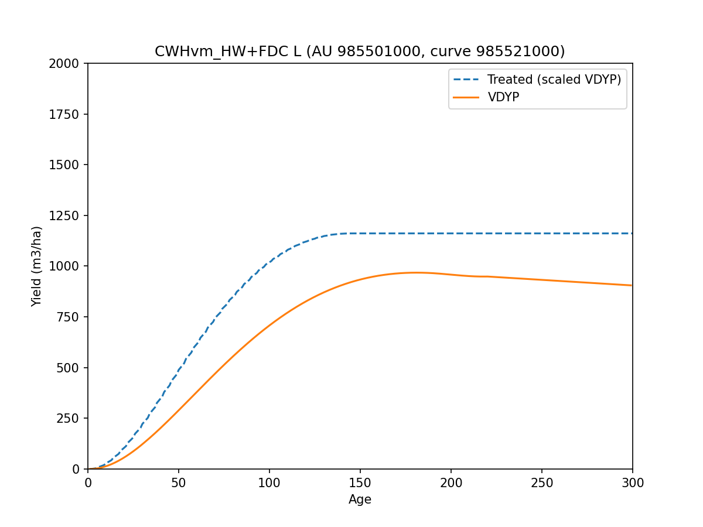

   Treated (scaled-VDYP) curve overlay for AU ``21000`` (source: ``plots/tipsy_vdyp_tsak3z-21000.png``).

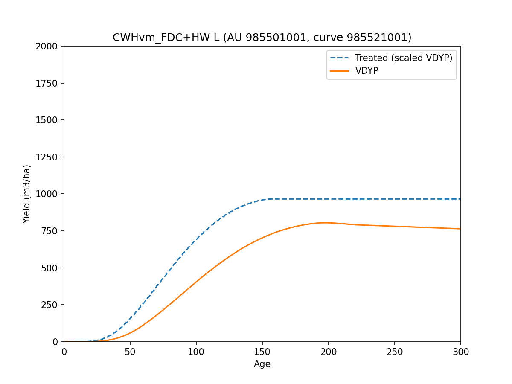

   Treated (scaled-VDYP) curve overlay for AU ``21001`` (source: ``plots/tipsy_vdyp_tsak3z-21001.png``).

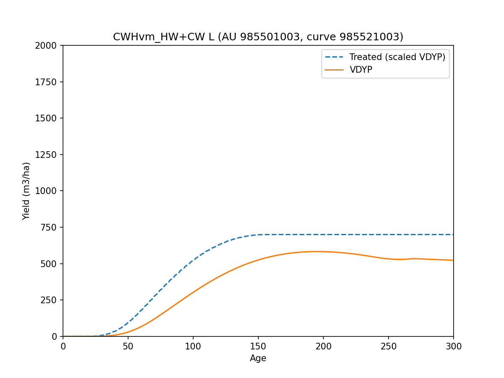

   Treated (scaled-VDYP) curve overlay for AU ``21003`` (source: ``plots/tipsy_vdyp_tsak3z-21003.png``).

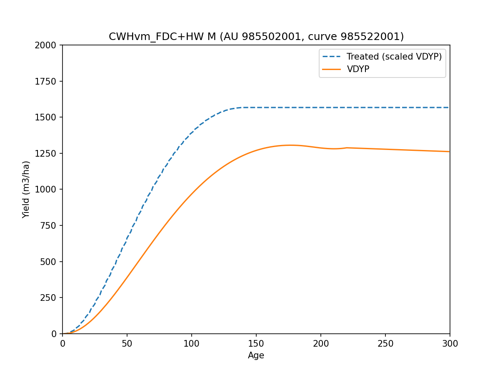

   Treated (scaled-VDYP) curve overlay for AU ``22001`` (source: ``plots/tipsy_vdyp_tsak3z-22001.png``).

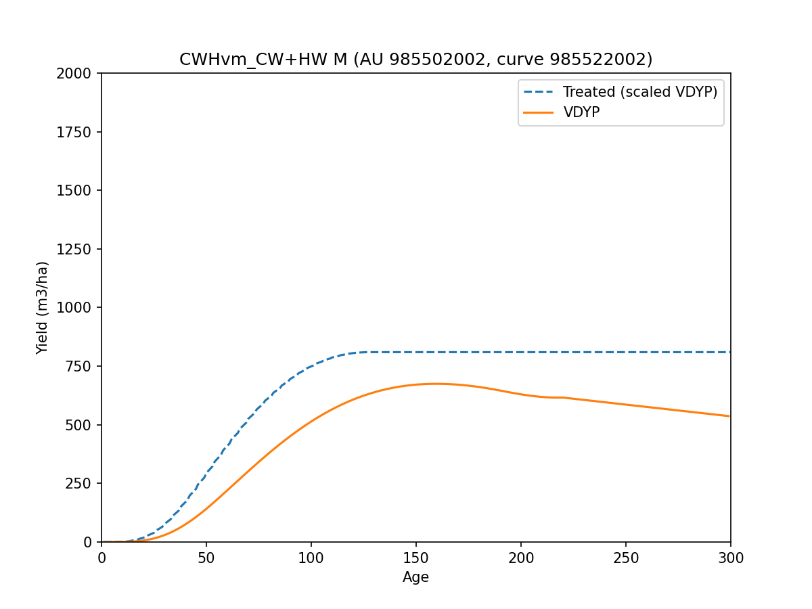

   Treated (scaled-VDYP) curve overlay for AU ``22002`` (source: ``plots/tipsy_vdyp_tsak3z-22002.png``).

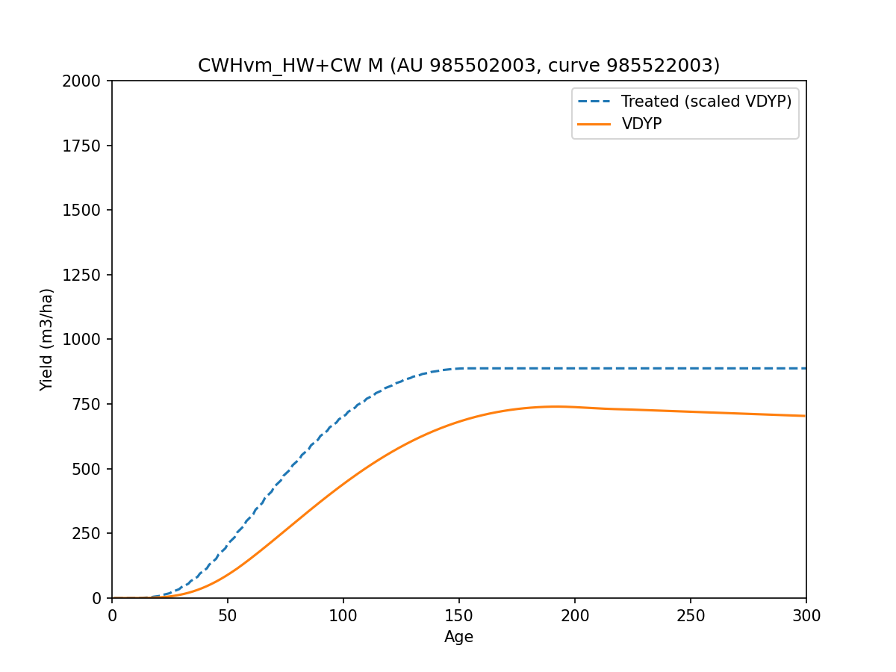

   Treated (scaled-VDYP) curve overlay for AU ``22003`` (source: ``plots/tipsy_vdyp_tsak3z-22003.png``).

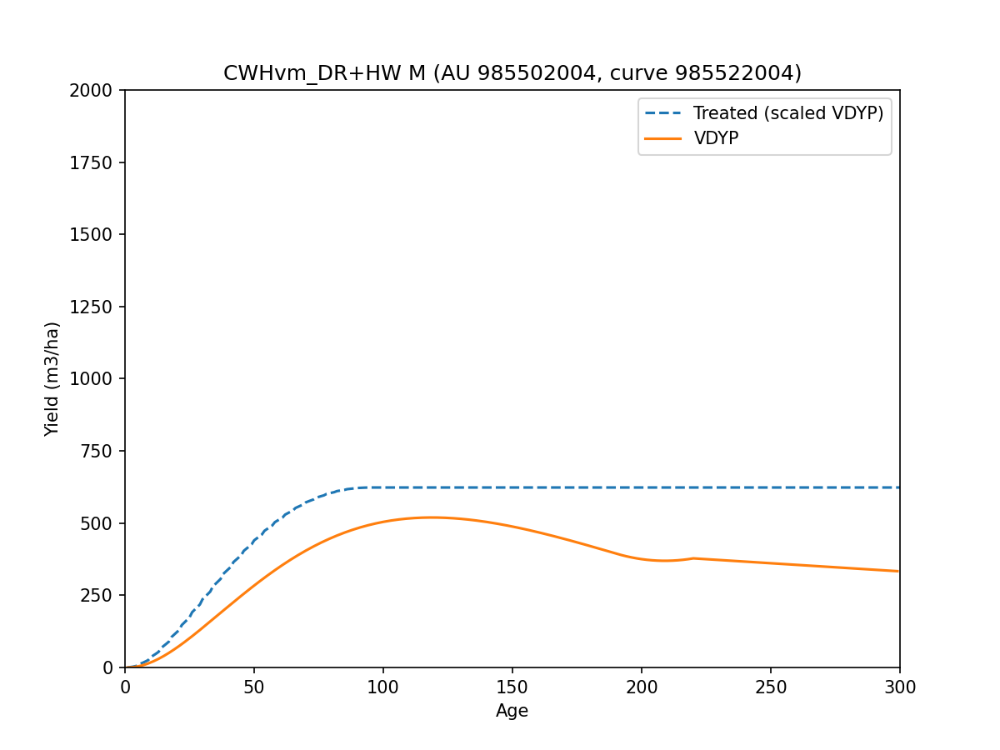

   Treated (scaled-VDYP) curve overlay for AU ``22004`` (source: ``plots/tipsy_vdyp_tsak3z-22004.png``).

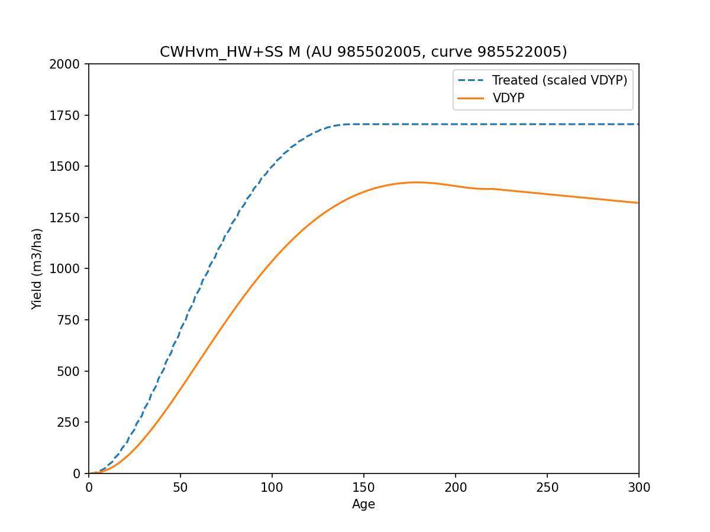

   Treated (scaled-VDYP) curve overlay for AU ``22005`` (source: ``plots/tipsy_vdyp_tsak3z-22005.png``).

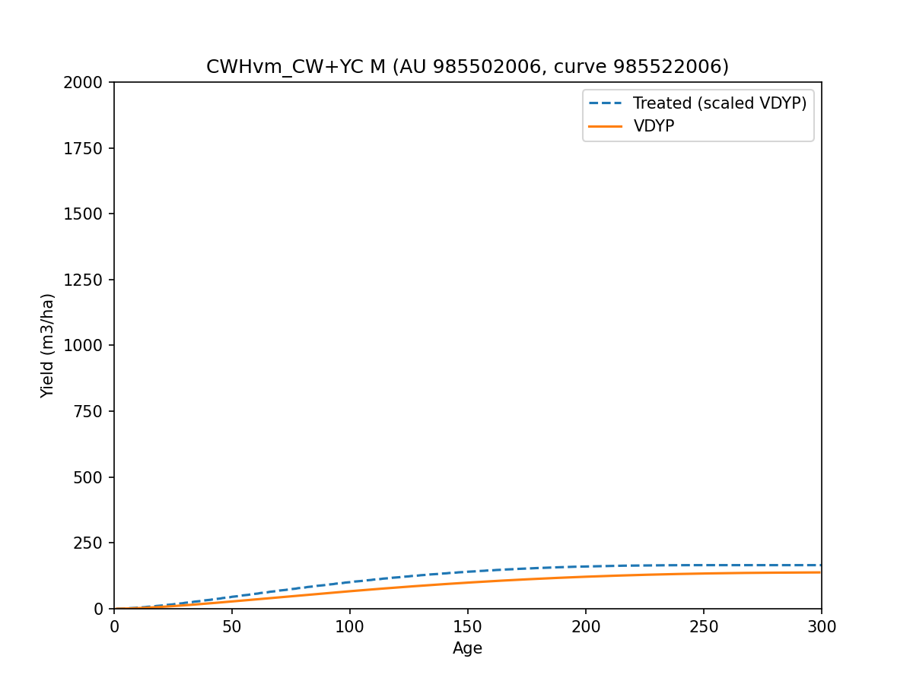

   Treated (scaled-VDYP) curve overlay for AU ``22006`` (source: ``plots/tipsy_vdyp_tsak3z-22006.png``).

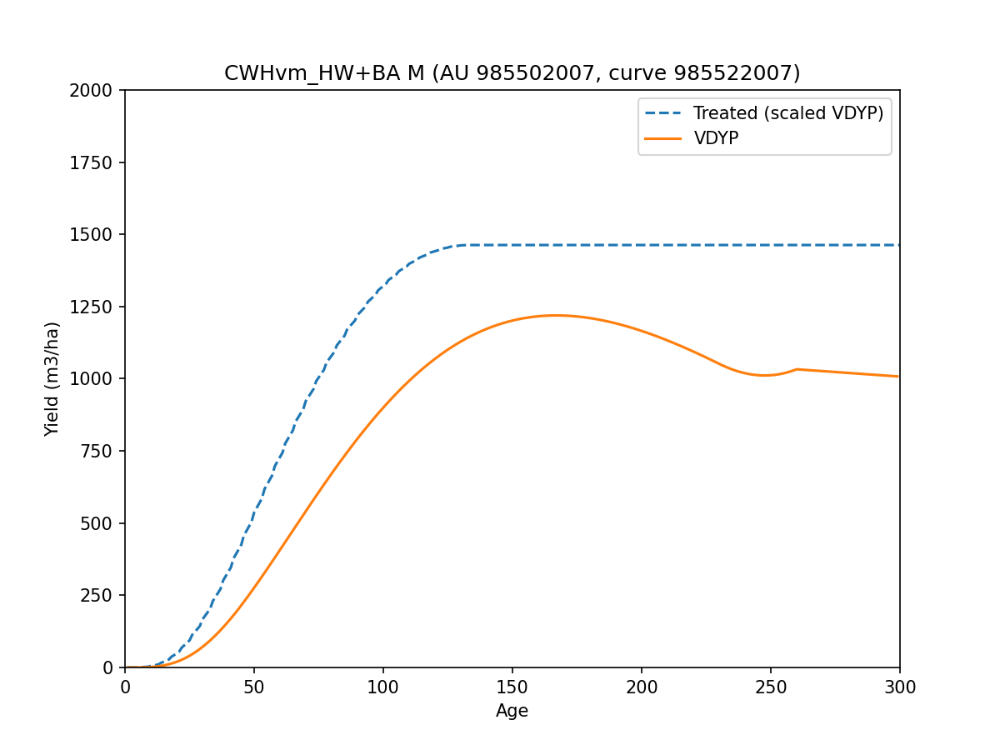

   Treated (scaled-VDYP) curve overlay for AU ``22007`` (source: ``plots/tipsy_vdyp_tsak3z-22007.png``).

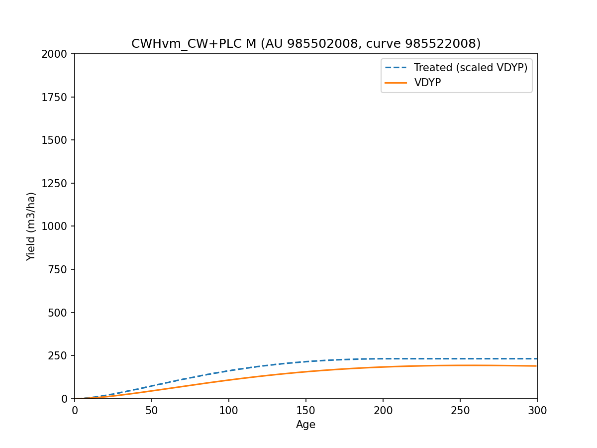

   Treated (scaled-VDYP) curve overlay for AU ``22008`` (source: ``plots/tipsy_vdyp_tsak3z-22008.png``).

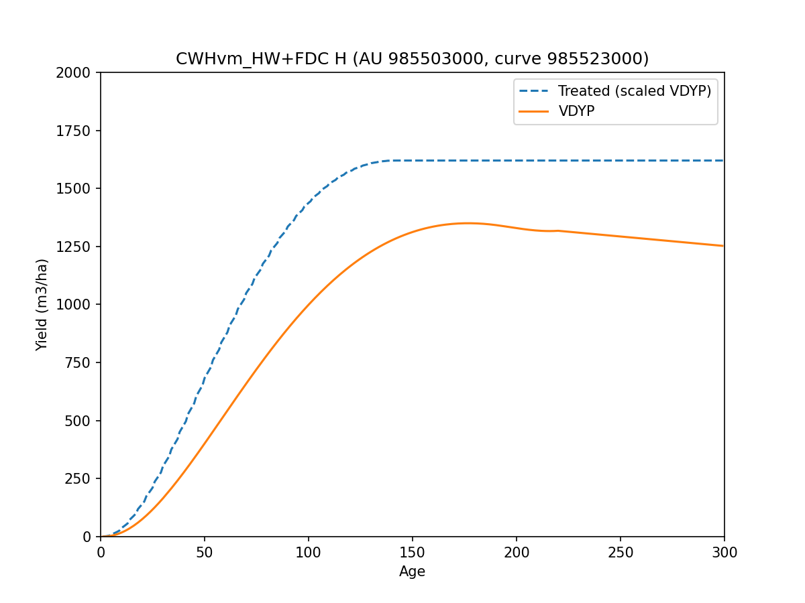

   Treated (scaled-VDYP) curve overlay for AU ``23000`` (source: ``plots/tipsy_vdyp_tsak3z-23000.png``).

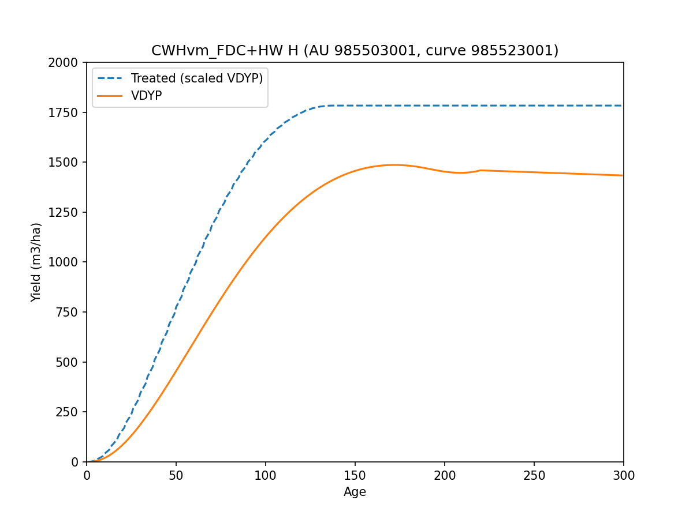

   Treated (scaled-VDYP) curve overlay for AU ``23001`` (source: ``plots/tipsy_vdyp_tsak3z-23001.png``).

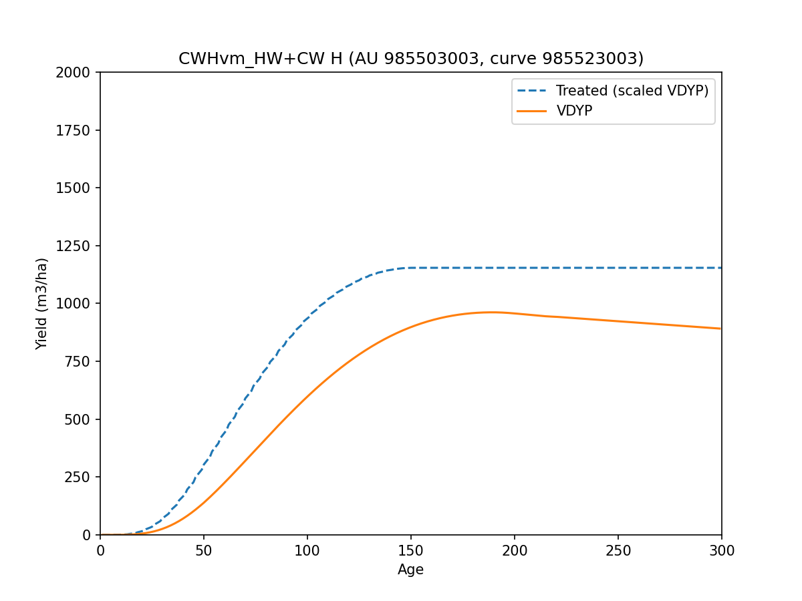

   Treated (scaled-VDYP) curve overlay for AU ``23003`` (source: ``plots/tipsy_vdyp_tsak3z-23003.png``).

Full Plot Inventory
-------------------

Rendered figures are sourced from these plot artifacts:

- ``plots/strata-tsak3z.png``
- ``plots/tipsy_vdyp_tsak3z-21000.png``
- ``plots/tipsy_vdyp_tsak3z-21001.png``
- ``plots/tipsy_vdyp_tsak3z-21003.png``
- ``plots/tipsy_vdyp_tsak3z-22001.png``
- ``plots/tipsy_vdyp_tsak3z-22002.png``
- ``plots/tipsy_vdyp_tsak3z-22003.png``
- ``plots/tipsy_vdyp_tsak3z-22004.png``
- ``plots/tipsy_vdyp_tsak3z-22005.png``
- ``plots/tipsy_vdyp_tsak3z-22006.png``
- ``plots/tipsy_vdyp_tsak3z-22007.png``
- ``plots/tipsy_vdyp_tsak3z-22008.png``
- ``plots/tipsy_vdyp_tsak3z-23000.png``
- ``plots/tipsy_vdyp_tsak3z-23001.png``
- ``plots/tipsy_vdyp_tsak3z-23003.png``
- ``plots/vdyp_fitdiag_tsak3z-00-CWHvm_HW+FDC-H.png``
- ``plots/vdyp_fitdiag_tsak3z-00-CWHvm_HW+FDC-L.png``
- ``plots/vdyp_fitdiag_tsak3z-00-CWHvm_HW+FDC-M.png``
- ``plots/vdyp_fitdiag_tsak3z-01-CWHvm_FDC+HW-H.png``
- ``plots/vdyp_fitdiag_tsak3z-01-CWHvm_FDC+HW-L.png``
- ``plots/vdyp_fitdiag_tsak3z-01-CWHvm_FDC+HW-M.png``
- ``plots/vdyp_fitdiag_tsak3z-02-CWHvm_CW+HW-H.png``
- ``plots/vdyp_fitdiag_tsak3z-02-CWHvm_CW+HW-L.png``
- ``plots/vdyp_fitdiag_tsak3z-02-CWHvm_CW+HW-M.png``
- ``plots/vdyp_fitdiag_tsak3z-03-CWHvm_HW+CW-H.png``
- ``plots/vdyp_fitdiag_tsak3z-03-CWHvm_HW+CW-L.png``
- ``plots/vdyp_fitdiag_tsak3z-03-CWHvm_HW+CW-M.png``
- ``plots/vdyp_fitdiag_tsak3z-04-CWHvm_DR+HW-H.png``
- ``plots/vdyp_fitdiag_tsak3z-04-CWHvm_DR+HW-L.png``
- ``plots/vdyp_fitdiag_tsak3z-04-CWHvm_DR+HW-M.png``
- ``plots/vdyp_fitdiag_tsak3z-05-CWHvm_HW+SS-H.png``
- ``plots/vdyp_fitdiag_tsak3z-05-CWHvm_HW+SS-L.png``
- ``plots/vdyp_fitdiag_tsak3z-05-CWHvm_HW+SS-M.png``
- ``plots/vdyp_fitdiag_tsak3z-06-CWHvm_CW+YC-H.png``
- ``plots/vdyp_fitdiag_tsak3z-06-CWHvm_CW+YC-L.png``
- ``plots/vdyp_fitdiag_tsak3z-06-CWHvm_CW+YC-M.png``
- ``plots/vdyp_fitdiag_tsak3z-07-CWHvm_HW+BA-H.png``
- ``plots/vdyp_fitdiag_tsak3z-07-CWHvm_HW+BA-L.png``
- ``plots/vdyp_fitdiag_tsak3z-07-CWHvm_HW+BA-M.png``
- ``plots/vdyp_fitdiag_tsak3z-08-CWHvm_CW+PLC-H.png``
- ``plots/vdyp_fitdiag_tsak3z-08-CWHvm_CW+PLC-L.png``
- ``plots/vdyp_fitdiag_tsak3z-08-CWHvm_CW+PLC-M.png``
- ``plots/vdyp_lmh_tsak3z-00-CWHvm_HW+FDC.png``
- ``plots/vdyp_lmh_tsak3z-01-CWHvm_FDC+HW.png``
- ``plots/vdyp_lmh_tsak3z-02-CWHvm_CW+HW.png``
- ``plots/vdyp_lmh_tsak3z-03-CWHvm_HW+CW.png``
- ``plots/vdyp_lmh_tsak3z-04-CWHvm_DR+HW.png``
- ``plots/vdyp_lmh_tsak3z-05-CWHvm_HW+SS.png``
- ``plots/vdyp_lmh_tsak3z-06-CWHvm_CW+YC.png``
- ``plots/vdyp_lmh_tsak3z-07-CWHvm_HW+BA.png``
- ``plots/vdyp_lmh_tsak3z-08-CWHvm_CW+PLC.png``
- ``plots/strata-tsak3z.pdf``
