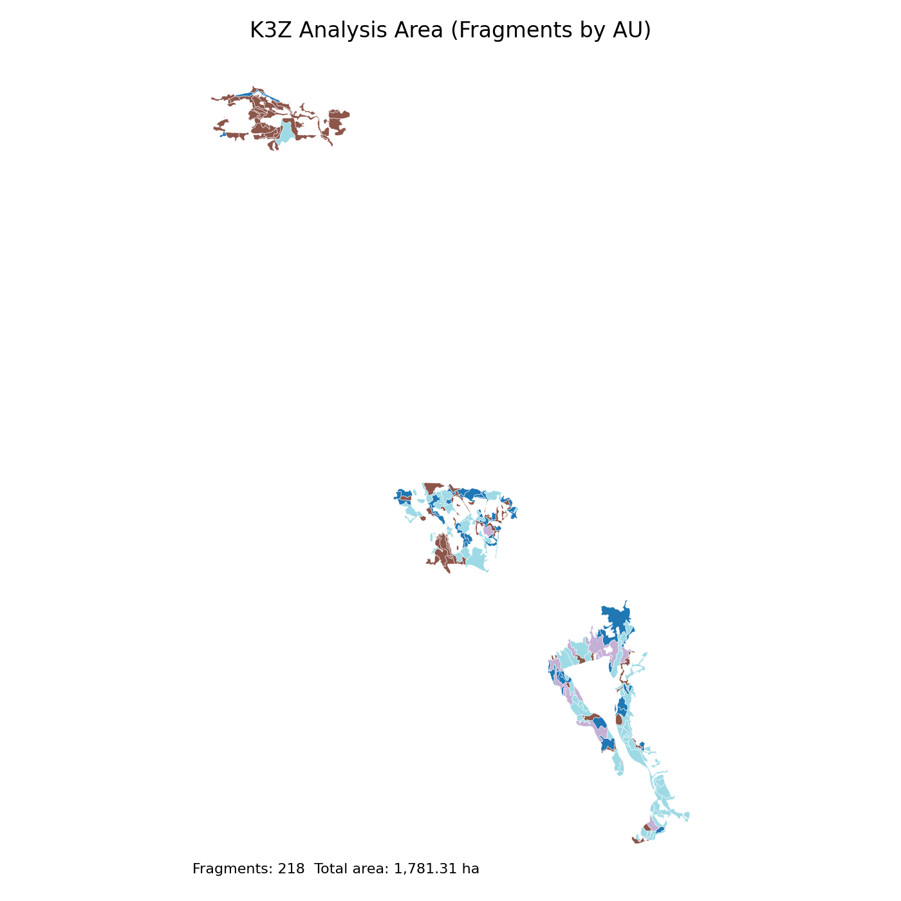

Land Base and Netdown
=====================

Introduction
------------

This page documents K3Z land-base compilation assumptions in the same style as
BC timber supply data packages.

Land Base Definition
--------------------

K3Z land base for Patchworks runtime is represented by:

- source fragments in ``output/patchworks_k3z_validated/fragments/``
- model blocks in ``models/k3z_patchworks_model/blocks/``
- active tracks in ``models/k3z_patchworks_model/tracks/``

Data Sources and Inventory
--------------------------

- Base inventory inputs from instance ``data/`` and staged bundle outputs in
  ``data/model_input_bundle/``.
- Curated model package under ``models/k3z_patchworks_model/`` is authoritative
  for Patchworks loading.

Exclusions from Contributing Forest
-----------------------------------

Current K3Z baseline treats all modeled fragments as contributing for this
training case. Exclusions are introduced only when encoded explicitly in
upstream bundle transforms.

Reductions from THLB (Netdown Logic)
------------------------------------

Current training baseline forces THLB-equivalent treatment eligibility to full
coverage for modeled fragments, with deferred refinement of uncertain legacy
raster-derived THLB layers.

Landbase Characteristics
------------------------

- Block joins are expected 1:1 between ``tracks/blocks.csv`` and
  ``blocks/blocks.shp``.
- Managed area baseline is validated through reproducibility checks in
  ``rebuild-and-qa.rst``.
- A full plot catalog is documented in :ref:`k3z-figure-appendix`.

Analysis Area Map
-----------------

   K3Z analysis area map derived from
   ``output/patchworks_k3z_validated/fragments/fragments.shp`` with fragments
   colored by AU.

Total Area and THLB Summary
---------------------------

.. list-table::
   :header-rows: 1

   * - Metric
     - Value (ha)
     - Notes
   * - Total analysis area (fragments sum)
     - 1,781.31
     - Summed from ``AREA_HA`` in fragments shapefile.
   * - THLB area (current training baseline)
     - 1,781.31
     - Current baseline treats all modeled fragments as THLB-equivalent.
   * - Non-THLB area
     - 0.00
     - Deferred to a future netdown implementation.

Area by AU
----------

.. list-table::
   :header-rows: 1

   * - AU
     - Area (ha)
   * - 985503000
     - 408.53
   * - 985502002
     - 290.11
   * - 985502001
     - 189.62
   * - 985503001
     - 182.99
   * - 985501000
     - 153.31
   * - 985501001
     - 152.74
   * - 985503003
     - 107.85
   * - 985502004
     - 66.09
   * - 985502003
     - 50.39
   * - 985501003
     - 48.04
   * - 985502006
     - 41.15
   * - 985502008
     - 32.47
   * - 985502005
     - 29.69
   * - 985502007
     - 28.32

Provenance Table
----------------

.. list-table::
   :header-rows: 1

   * - Artifact Family
     - Update Date
     - Source Path/URL
     - Transform Stage
     - QA Status
   * - Fragments inputs
     - Per rebuild run
     - ``output/patchworks_k3z_validated/fragments/``
     - Patchworks export validation
     - Verified by matrix-build manifest
   * - Blocks and topology
     - Per rebuild run
     - ``models/k3z_patchworks_model/blocks/``
     - ``femic patchworks build-blocks``
     - Verified by join invariants
   * - Tracks block mapping
     - Per matrix build
     - ``models/k3z_patchworks_model/tracks/blocks.csv``
     - ``femic patchworks matrix-build``
     - Verified by reproducibility checks
   * - Analysis area map
     - Per docs refresh
     - ``docs/_static/k3z_analysis_area_map.png``
     - Derived from fragments shapefile
     - Visual QA and AU-area consistency check

THLB Netdown Placeholder Table
------------------------------

.. list-table::
   :header-rows: 1

   * - Netdown category
     - Applied in baseline
     - Area reduction (ha)
     - Notes
   * - Operability
     - No
     - 0.00
     - Placeholder; explicit policy not yet encoded for K3Z baseline.
   * - Non-forest / non-productive
     - No
     - 0.00
     - Placeholder; add when netdown input layers are formalized.
   * - Environmental / legal constraints
     - No
     - 0.00
     - Placeholder for future policy scenarios.
   * - Other exclusions
     - No
     - 0.00
     - No additional reductions in current training baseline.

What to Edit vs Regenerate
--------------------------

- Edit: ``config/*.yaml`` assumptions and runtime settings.
- Regenerate: ``blocks/*`` and ``tracks/*.csv`` outputs.
- Do not hand-edit generated block/track tables unless you also update
  reproducibility baselines.

How to Validate Reruns
----------------------

1. Run ``femic patchworks build-blocks`` then ``femic patchworks matrix-build``.
2. Run the deterministic rebuild check described in ``rebuild-and-qa.rst``.
3. Confirm managed-area and block-join invariants remain within baseline.
